# Connectors

← [Back to README](../README.md)

All the internal connectors that need to be bridged between the T60 chassis and the candidate board. Images are in the `images/` folder, spec sheets in `specs/`.

---

## Keyboard

| Property | Value |
|---|---|
| Positions | 40 (dual row) |
| Pitch | 0.50 mm |
| Center island | 9.7 x 1.1 mm |
| Insertion depth | 1.2 mm |

**Status: confirmed**

- ✅ JAE AA01B-S040VA1-R3000
- ❓ Molex SlimStack 543630478 *(unconfirmed)*
- ❓ Molex SlimStack 543630479 *(unconfirmed)*

---

## Touchpad

| Property | Value |
|---|---|
| Positions | 20 (dual row) |
| Pitch | 0.30 mm |
| Mating cavity | 5.60 x 2.50 mm |
| Insertion depth | 2.00 mm |

**Status: ~99% confident, not yet ordered**

- ❓ Hirose DF12NB(3.0)-20DP-0.5V(51) *(unconfirmed)*
- ❓ TXGA FBB05008-F20S1013W5MH44 *(unconfirmed)*

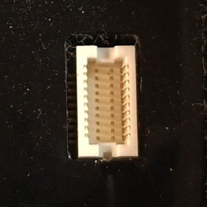
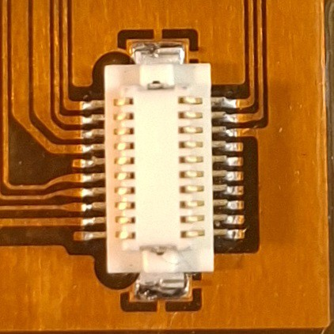

---

## Screen Assembly

| Property | Value |
|---|---|
| Positions | 80 (dual row) |
| Pitch | 0.60 mm |
| Polarizing key slot lengths | 24.50 mm / 26.00 mm |
| Center island width | 2.50 mm |
| Insertion depth | 2.50 mm |

**Status: close but not confirmed** — the best match (Hirose FX8C-80S-SV) has a center island of 3.0 mm instead of 2.5 mm, and the keying doesn't line up either, though that's less of a concern than the island width. JAE KX14/15 series is another lead worth checking.

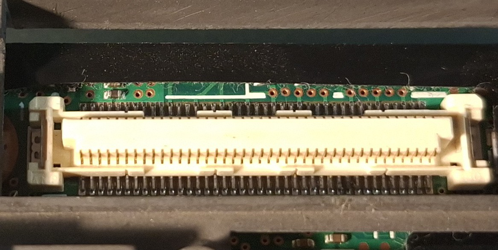
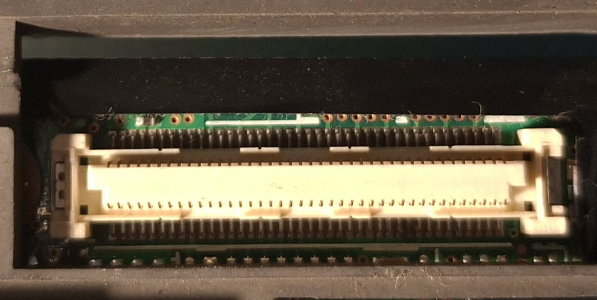
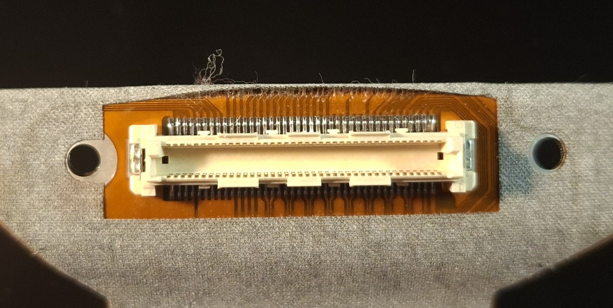

---

## Speaker

| Property | Value |
|---|---|
| Positions | 4 |
| Pitch | 1.15 mm |
| Housing body | 5.40 x 2.15 mm |
| Pin excursion | 0.80 mm |

**Status: good bet, not confirmed**

- ❓ Molex PicoBlade JT-A1250WV-4P *(unconfirmed)*

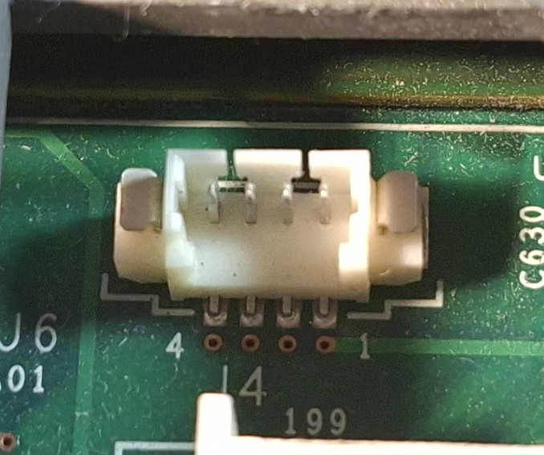
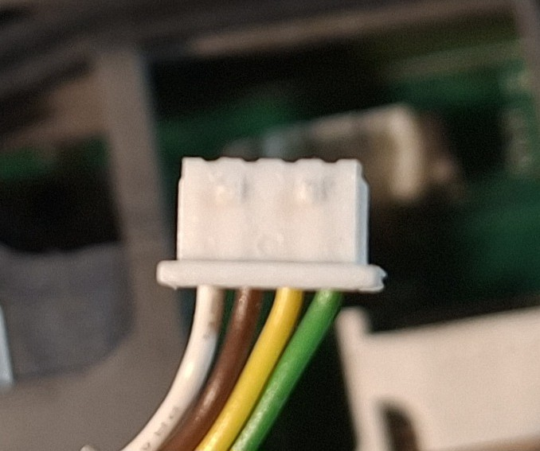
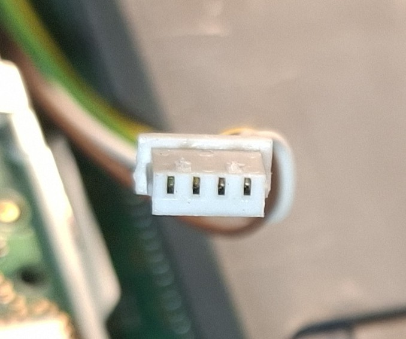

---

## Battery

| Property | Value |
|---|---|
| Positions | 8 |
| Pitch | 2.00 mm |
| Terminal width | 0.55 mm |
| Terminal length | 4.20 mm / 3.50 mm (dual-length) |
| Terminal height | 2.60 mm |
| Contact elevation | 0.60 mm |
| Boss dimensions | 1.30 x 5.70 mm |

**Status: likely replaceable with a generic AliExpress part**

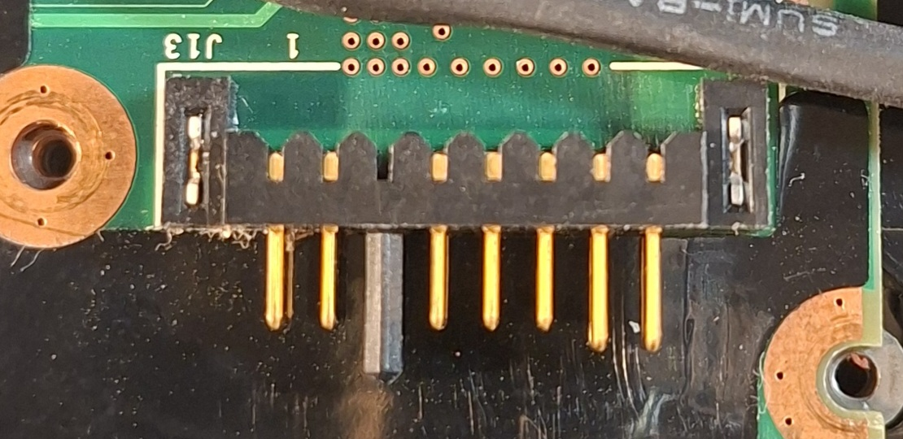

---

## DC-in (Power)

| Property | Value |
|---|---|
| Positions | 5 |
| Pitch | 2.50 mm |
| Housing body | 14.30 x 3.45 mm |
| Pin excursion | 4.20 mm |

**Status: not thoroughly researched yet**

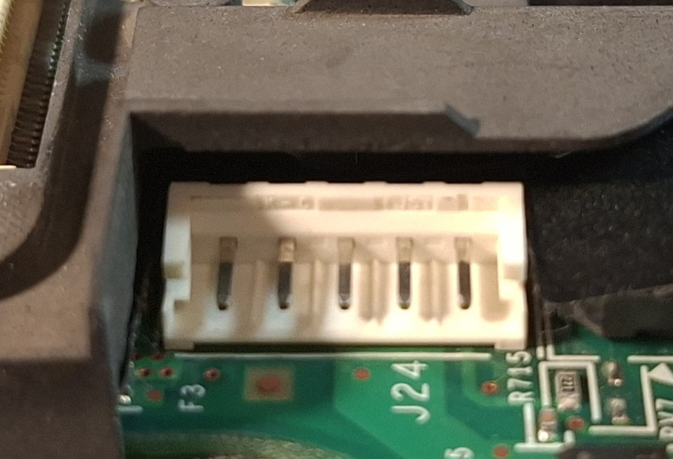
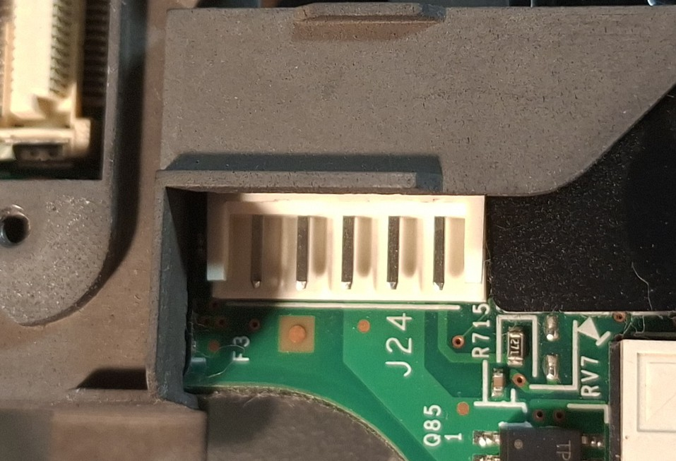
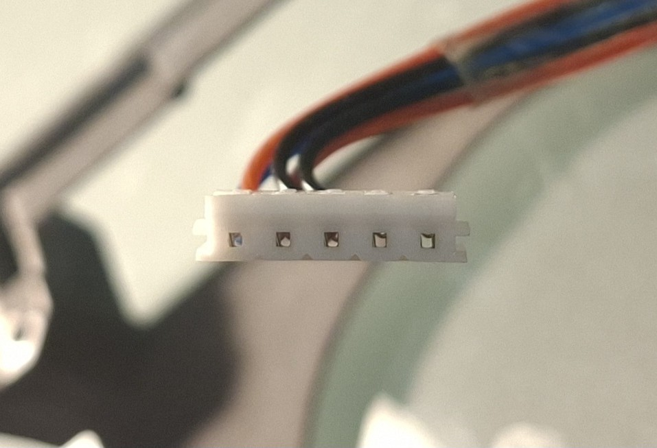
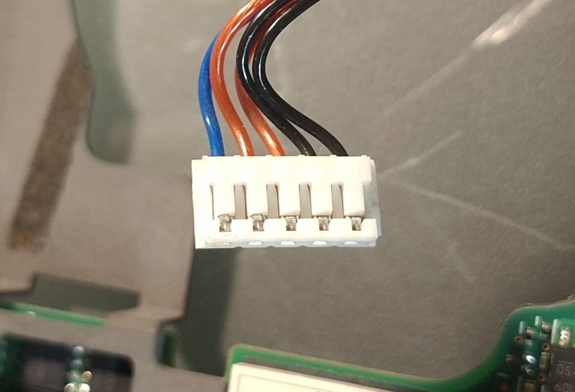
