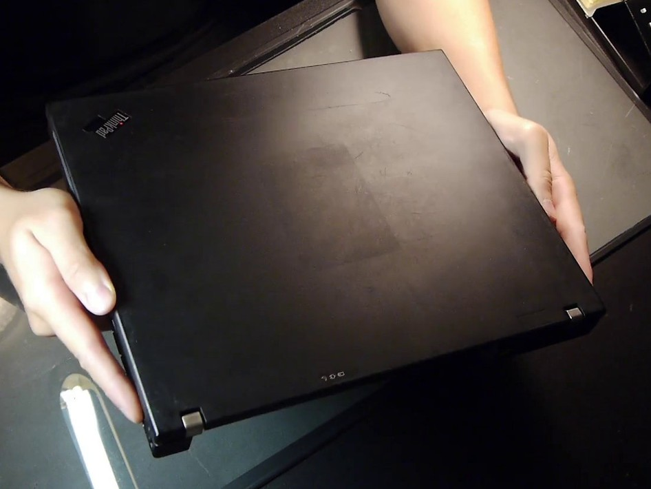
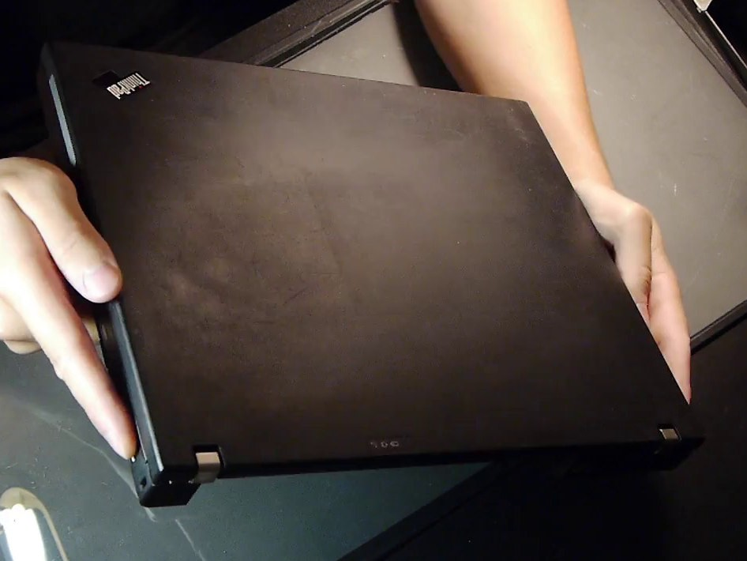
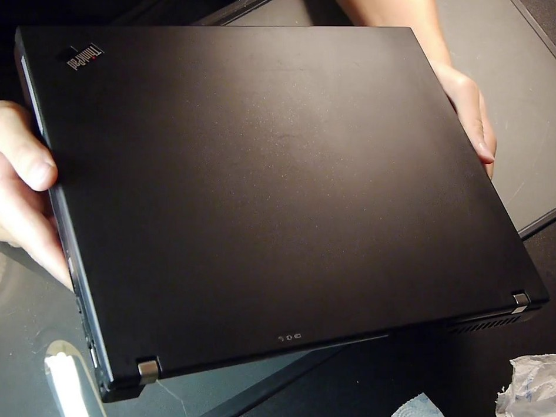
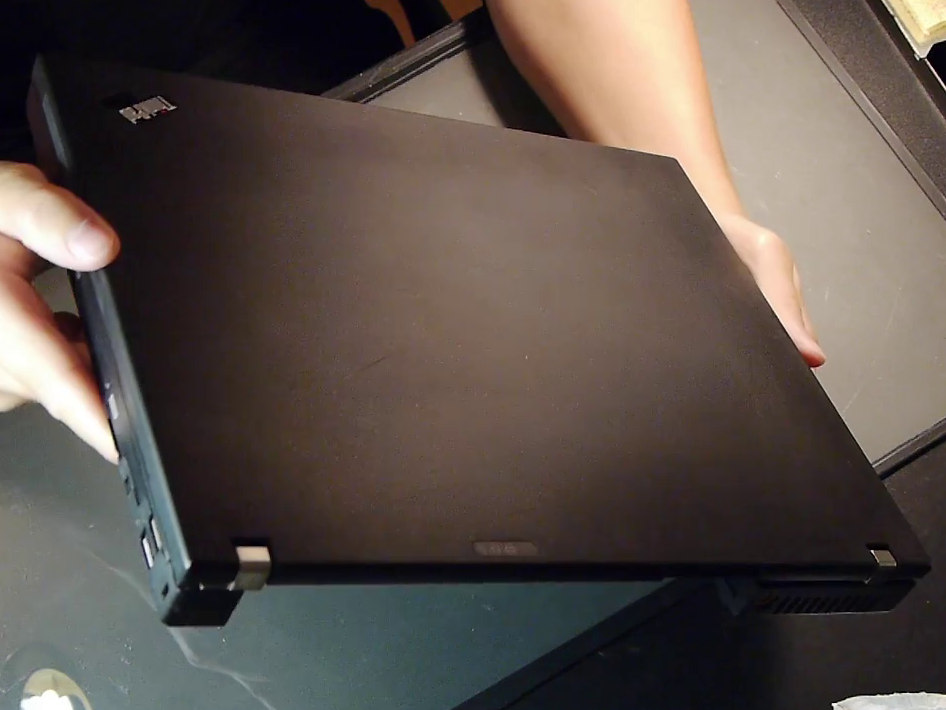
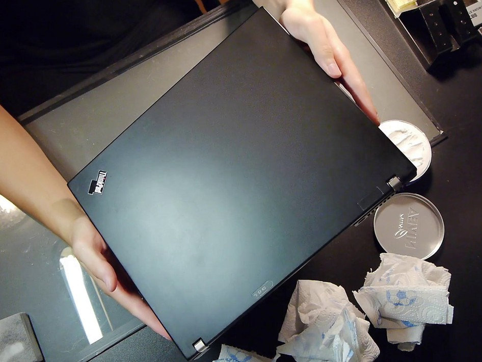
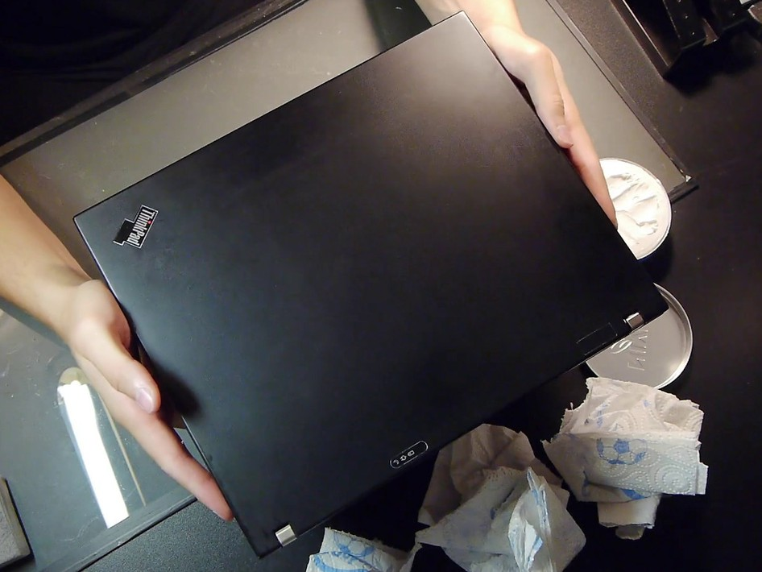

# Cosmetic — Rubberized Coating

← [Back to README](../README.md)

The T60's rubberized coating gets sticky and gross over time. Turns out it cleans up really well with a melamine magic eraser and some Nivea cream.

## Process

1. **Dry pass** — gentle, uniform pressure with a DM-branded smooth melamine magic eraser block for about 3 minutes.
2. **Wet pass** — another 3 minutes with the eraser slightly wet.
3. Wipe dry.
4. Apply a generous amount of Nivea cream, then wipe clean.

That's it. The result is surprisingly good.

## Before

## During — Sanding

## After — Nivea Applied

