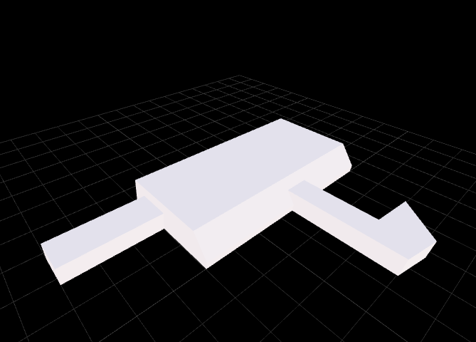
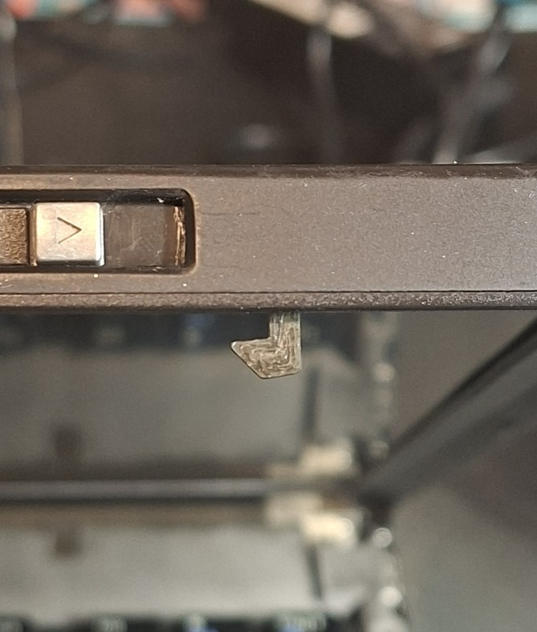

← [Back to README](../README.md)

# Cosmetic

| | |
|---|---|
| [Rubberized Coating](#cosmetic--rubberized-coating) | Cleaning up the sticky coating |
| [Broken Lid Latch Hook](#cosmetic--broken-lid-latch-hook) | 3D printed replacement part |
| | |

# Cosmetic — Rubberized Coating

The T60's rubberized coating gets sticky and gross over time. Turns out it cleans up really well with a melamine magic eraser and some Nivea cream.

## Process

1. **Dry pass** — gentle, uniform pressure with a DM-branded smooth melamine magic eraser block for about 3 minutes.
2. **Wet pass** — another 3 minutes with the eraser slightly wet.
3. Wipe dry.
4. Apply a generous amount of Nivea cream, then wipe clean.

That's it. The result is surprisingly good.

## Before

## During — Sanding

## After — Nivea Applied

---

# Cosmetic — Broken Lid Latch Hook

The 14" T60 I sourced had a broken right lid latch hook. Replacement parts are unobtainium at this point, so I modelled and printed one.

Files: [right_hook.FCStd](hook_right/right_hook.FCStd) · [right_hook.stl](hook_right/right_hook.stl)

