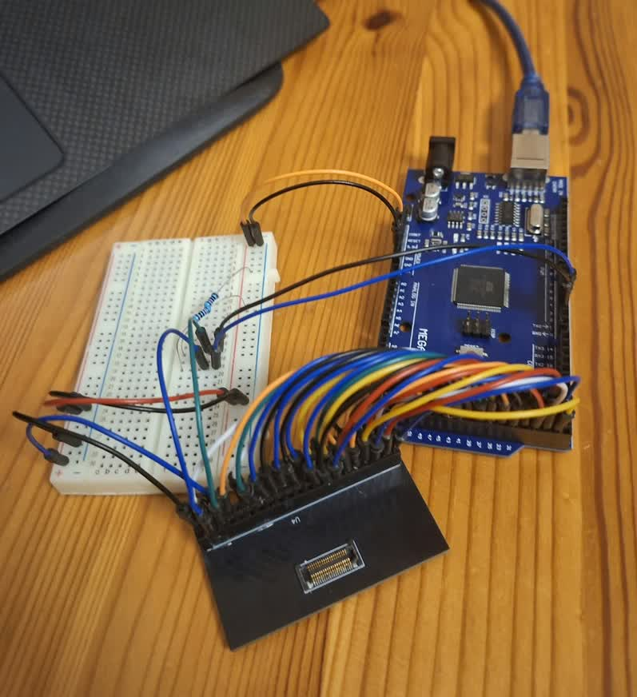
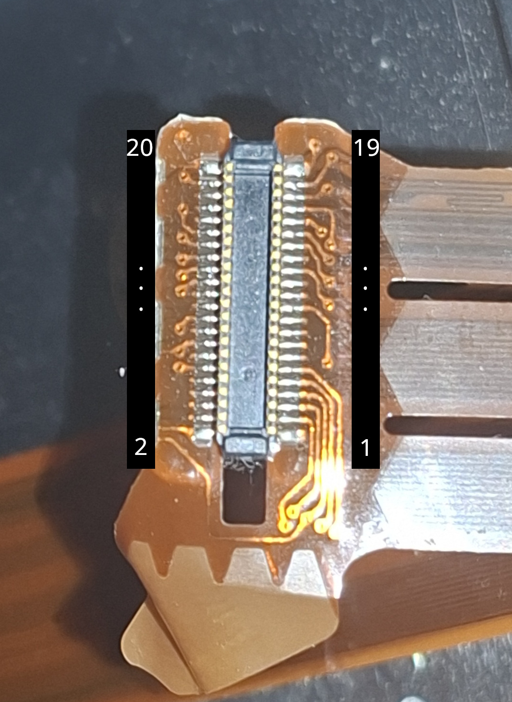

# Keyboard

← [Back to README](../README.md)

The T60 keyboard is a plain matrix interface — no active components on the keyboard itself, just a grid of switches. It also carries the PS2 TrackPoint lanes on the same cable.

The connector is confirmed. See [Connectors](../Connectors/connectors.md#keyboard) for the full spec.

## Bridging it

The plan is to make a fully open source version. Prototyping started with a breakout board and an Arduino Mega to reverse engineer the matrix.

The main reference is Frank Adams' Pi Pico T61 keyboard controller — practically a complete solution, just not widely surfaced. The Scribd document is mirrored locally at `docs/specs.pdf` since Scribd is paywalled behind ads. The GitHub repo has the full source:

- `docs/specs.pdf` — [Pi Pico T61 Keyboard Controller](https://www.scribd.com/document/997574050/Pi-Pico-T61-Keyboard-Controller)
- [Pico_T61_Keyboard](https://github.com/thedalles77/USB_Laptop_Keyboard_Controller/tree/master/Example_Keyboards/Pico_T61_Keyboard)

The gerber for the breakout board is in this folder: `Gerber_T60_Keyboard-Breakout.zip`

## Keyboard

The scanner sketch is in `test_keyboard/test_keyboard.ino`. It drives each DRIVE line LOW in turn and reads the SENSE lines, printing the key name and coordinates over serial.

### Wiring (Arduino Mega)

The JAE connector is not keyed — pin 1 is marked on the breakout board. Refer to the pinout below before wiring.

| JAE Pin | Signal | Arduino Mega Pin |
|---|---|---|
| 1 | HOTKEY | 22 |
| 2 | DRIVE\<4\> | 23 |
| 3 | SENSE\<5\> | 24 |
| 4 | DRIVE\<5\> | 25 |
| 5 | SENSE\<0\> | 26 |
| 6 | DRIVE\<8\> | 27 |
| 7 | SENSE\<3\> | 28 |
| 8 | DRIVE\<6\> | 29 |
| 9 | SENSE\<2\> | 30 |
| 10 | DRIVE\<3\> | 31 |
| 11 | SENSE\<4\> | 32 |
| 12 | DRIVE\<7\> | 33 |
| 13 | SENSE\<1\> | 34 |
| 14 | DRIVE\<2\> | 35 |
| 15 | SENSE\<6\> | 36 |
| 16 | DRIVE\<10\> | 37 |
| 17 | SENSE\<7\> | 38 |
| 18 | DRIVE\<1\> | 39 |
| 20 | DRIVE\<9\> | 41 |
| 22 | DRIVE\<0\> | 42 |
| 24 | DRIVE\<11\> | 43 |
| 26 | DRIVE\<14\> | 44 |
| 28 | DRIVE\<12\> | 45 |
| 30 | DRIVE\<15\> | 46 |
| 32 | DRIVE\<13\> | 40 |
| 36 | HOTKEY_RTN | 47 |

Full connector pinout in [connection.csv](connection.csv).

### Matrix

Verified with a Hungarian layout keyboard. ISO-102 is the extra key between Left Shift and Z (`í`/`<` on HU/NL). ISO-103 is the extra key right of the apostrophe (`ű`/`ú` on HU/NL).

| | S\<0\> | S\<1\> | S\<2\> | S\<3\> | S\<4\> | S\<5\> | S\<6\> | S\<7\> |
|---|---|---|---|---|---|---|---|---|
| **D\<0\>** | Back-Tick | 1 | Q | Tab | A | Esc | Z | |
| **D\<1\>** | F1 | 2 | W | Caps-Lock | S | ISO-102 | X | |
| **D\<2\>** | F2 | 3 | E | F3 | D | F4 | C | |
| **D\<3\>** | 5 | 4 | R | T | F | G | V | B |
| **D\<4\>** | 6 | 7 | U | Y | J | H | M | N |
| **D\<5\>** | Equal | 8 | I | Right-Brace | K | F6 | Comma | |
| **D\<6\>** | F8 | 9 | O | F7 | L | | Period | |
| **D\<7\>** | Minus | 0 | P | Left-Brace | Semi-colon | Quote | ISO-103 | Forward-Slash |
| **D\<8\>** | F9 | F10 | | Back-Space | Back-Slash | F5 | Enter | Space |
| **D\<9\>** | Insert | F12 | | | | | | Arrow-Right |
| **D\<10\>** | Delete | F11 | Volume-Up | Volume-Down | Mute | Think-Vantage | | Arrow-Down |
| **D\<11\>** | Page-Up | Page-Down | GUI | | Menu | | Page-Left | Page-Right |
| **D\<12\>** | Home | End | | | | Arrow-Up | Pause | Arrow-Left |
| **D\<13\>** | | Print-Screen | Scroll-Lock | | | Alt-L | | Alt-R |
| **D\<14\>** | | | | Shift-L | | | Shift-R | |
| **D\<15\>** | Ctrl-L | | | | | | Ctrl-R | |

## Power Button

Pressing the button closes PWR SW and PWR GND through a 200 Ω resistor. Wire them directly to whatever power button input the candidate board expects.

| JAE Pin | Signal |
|---|---|
| 19 | PWR SW |
| 34 | PWR GND |

## TrackPoint

The TrackPoint lanes are carried on the same JAE cable as the keyboard matrix.

The test sketch is in `test_trackpoint/test_trackpoint.ino`. It prints movement and button events over serial at 9600 baud.

### Wiring (Arduino Mega)

| JAE Pin | Signal | Arduino Mega Pin |
|---|---|---|
| 37 | TP_DATA | 2 |
| 38 | TP_5V | 5V |
| 39 | TP_CLK | 3 |
| 40 | TP_RESET | 48 |

TP_DATA and TP_CLK require 10kΩ pull-up resistors to 5V. The Arduino's internal pull-ups are too weak for PS2.

Pins 2 and 3 are hardware interrupt pins (INT0/INT1), which is intentional — the CLK line triggers an interrupt on each falling edge to capture bits reliably.

### Reset polarity

The T60 TrackPoint reset is active HIGH — hold LOW normally, pulse HIGH to reset. This is the opposite of what you might expect.

### Protocol

Standard PS2. The TrackPoint sends 3-byte packets in stream mode: status byte, X delta, Y delta.

Status byte layout:

| Bit | Meaning |
|---|---|
| 0 | Left button |
| 1 | Right button |
| 2 | Middle button |
| 3 | Always 1 (sync check) |
| 4 | X sign (negative if set) |
| 5 | Y sign (negative if set) |
| 6 | X overflow |
| 7 | Y overflow |

Packets where bit 3 is 0 or bits 6/7 are set are discarded as corrupt.

Y is inverted relative to screen coordinates — positive Y from the TrackPoint means cursor up.

### Sensitivity

The TrackPoint has two tunable RAM registers. The test sketch writes these on init via the `0xE2 0x81` write-to-RAM sequence:

| Register | Address | Default | Current |
|---|---|---|---|
| Sensitivity | 0x4A | 0x80 | 0xFF |
| Speed | 0x60 | 0x61 | 0xFF |

The raw delta values are signed 8-bit, so the physical maximum is ±127. At max sensitivity with firm pressure the TrackPoint typically caps out around ±50-60 — this is normal, it's a force sensor not a position sensor. Software-side acceleration is the right way to increase effective cursor speed.
