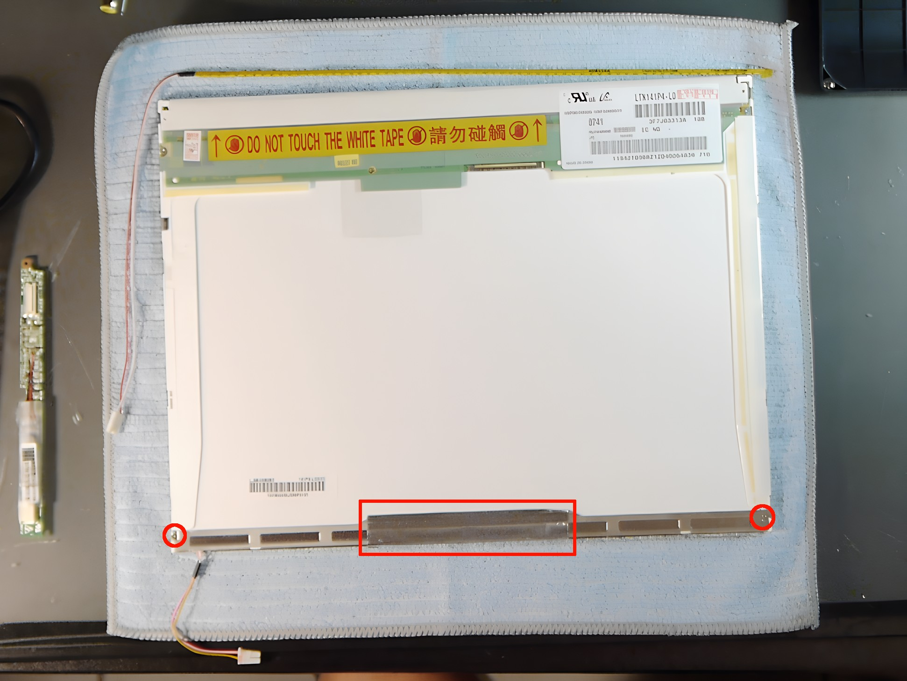
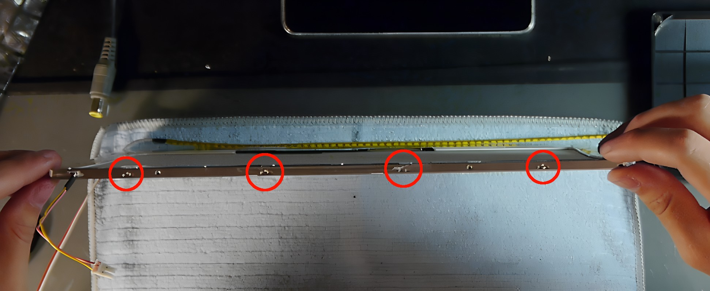
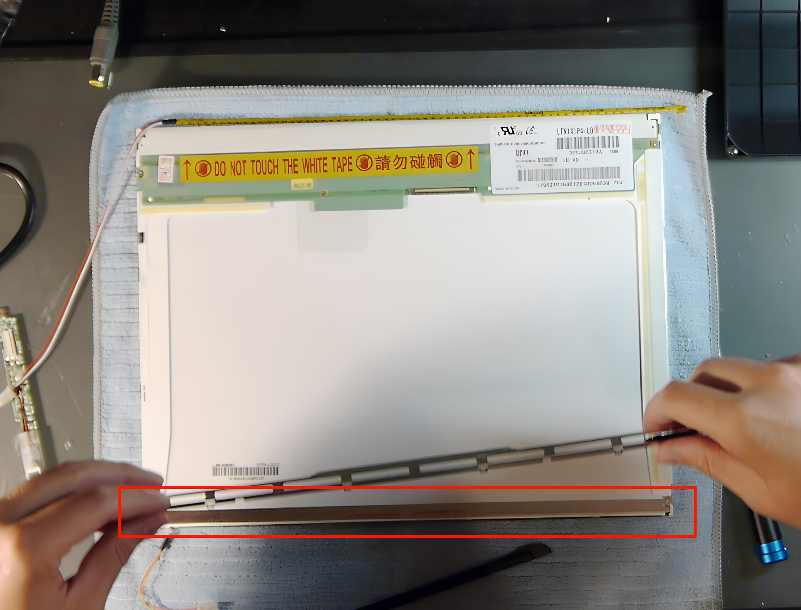
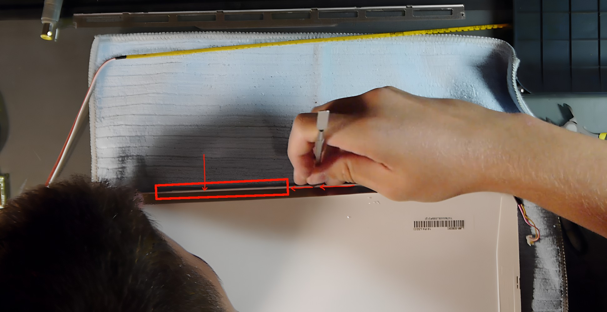
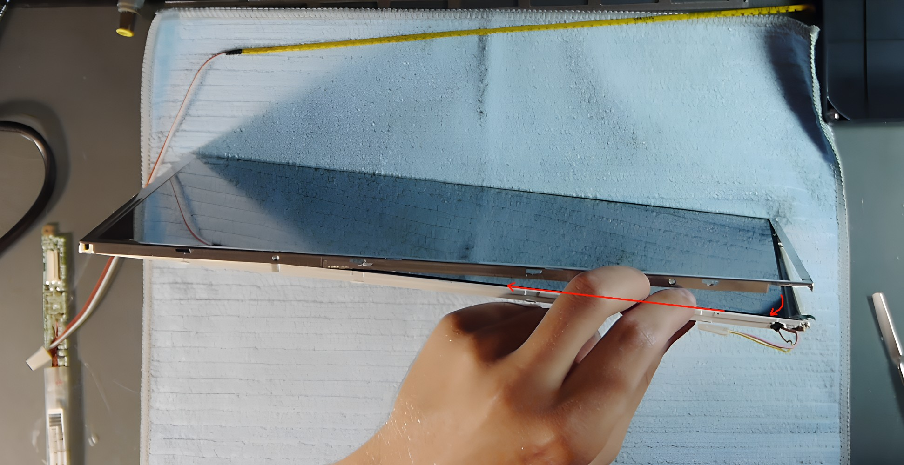
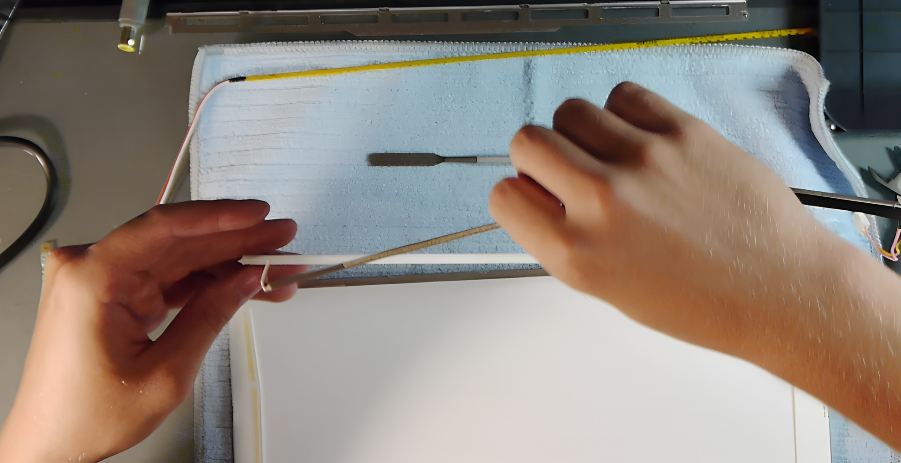
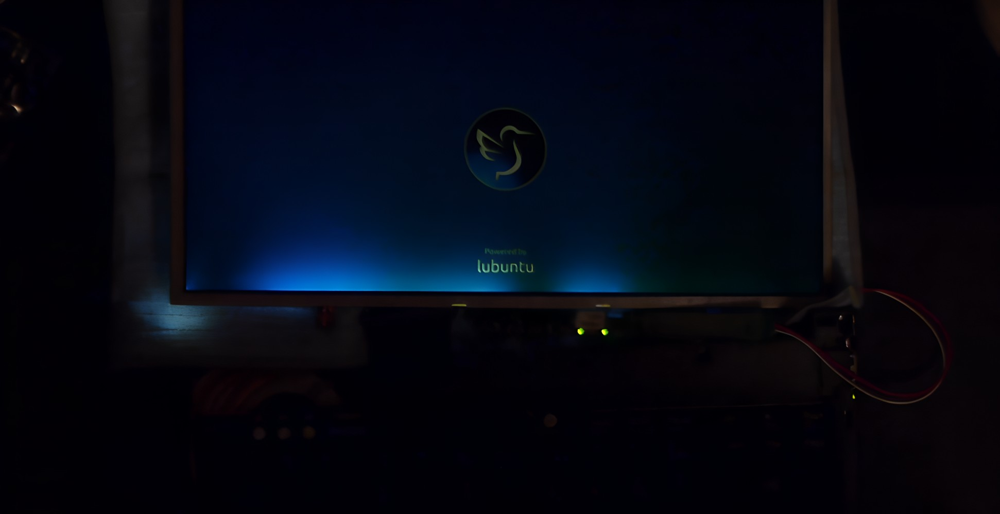

← [Back to README](../README.md)

← [Back to Screen](screen.md)

# LTN141P4 Disassembly and CCFL to LED Backlight Swap

The panel is surprisingly sturdy — even when prying it didn't snap. That said, it's still a delicate operation and there are a couple of non-obvious traps that will ruin the attempt if you don't know about them upfront. Image quality is mixed, apologies.

## Disassembly

1. Remove the 2 screws and the tape shown here.

   

2. Pop off the metal bracket by prying open the 4 clips.

   

3. The CCFL assembly can now be lifted straight up (along the normal vector, away from the panel face).

   

   > **Critical:** There is glue between the plastic panel housing and the metal assembly that isn't visible until you're already pulling. If you lift without removing it first, the assembly bends and snaps the fragile CCFL tube — which is exactly what happened here. Use a metal tool to scrape it out before lifting. Solvent might help but risks leaking into the panel.

   

4. The CCFL tube has terminals on opposite ends, so its wires are routed through a channel carved into the front of the plastic housing. To access them, remove the screws on the side of the metal bezel and lift it.

   > **Note:** The bezel can only be safely lifted on one side — the other end has very fine LCD panel wiring that doesn't give enough slack.

   

5. The wires inside the channel cannot be pulled out — they need to be cut. Lift the bezel and snip them as close to the far end as possible to minimize friction pulling through the channel.

   

6. With the CCFL assembly out, fit the replacement LED strip and reassemble.

   

## Result

The outcome was poor, though partly self-inflicted. The uneven lighting is almost certainly from bending the metal assembly during extraction (before knowing about the glue). A clean disassembly would likely fix that.

The bigger problem is brightness: at maximum, the LED strip is roughly as dim as the CCFL at minimum. Color temperature is also way off and the color balance is bad.

**Not recommended.** The risk-to-reward ratio is poor — one mistake and the panel won't go back together cleanly.