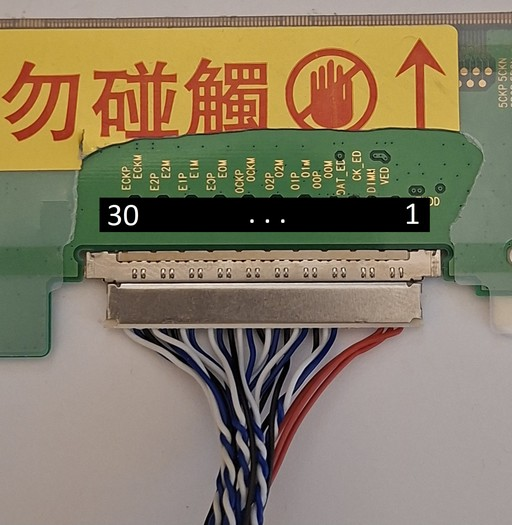
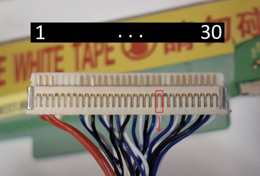

← [Back to README](../README.md)

← [Back to Screen](screen.md)

# EDP to LVDS

## The JX Board

Digging up info on this was a very exhausting task, but eventually these eeworld forum posts helped gain traction:

- [Low BOM cost EDP to LVDS conversion solution CS5211](docs/eeworld_JX_EDP_LVDS_CS5211_1.pdf)
- [CS5211/eDP to LVDS converter design circuit diagram](docs/eeworld_JX_EDP_LVDS_CS5211_2.pdf)

After arriving at [Shenzhen Jingxin Quartz Technology](docs/specs_JX_EDP_LVDS_CS5211.pdf)'s design, I ordered one. It has a 64kbit EEPROM onboard containing the firmware: [Shenzhen Hangshun Chip Technology HK24C64](docs/specs_SHCT_HK24C64.pdf).

## Firmware and EDID

The firmware can be dumped with an Arduino using the SDA/SCL pins:

```
./arduino.sh Screen/DumpROM --quiet > Screen/DumpROM/dump_CS5211.txt
```

The first 1024 bits of the firmware are the EDID repeated 16 times. This is because the [CS5211](docs/specs_CapStone_CS5211.pdf) supports 16 different EDID slots, selectable by pin. The factory-flashed [EDID](DumpROM/edid_dump_CS5210.csv) was for a 1920x1080 panel.

Since I was working with the LTN141P4 I needed its EDID. I reconstructed the [EDID](docs/edid_Samsung_LTN141P4-L03.csv) from its [datasheet](docs/specs_14inch_Samsung_LTN141P4-L03.pdf) and noticed some discrepancies in the note fields of the red and green high bits. So I also wrote a script to sanity check EDIDs:

```
python Screen/check_edid.py <edid.csv>
```

I also dumped my purchased panel's EDID by putting it into my ThinkPad T60 and booting it:

```
xxd -p /sys/class/drm/card1-LVDS-1/edid
```

The result is this [EDID](DumpROM/edid_dump_LTN141P4.csv), converted with `python Screen/dump_to_csv.py`. It doesn't appear to be a genuine Samsung panel, but it looks and works like a drop-in replacement so far, and it is hard to get your hands on unused new old hardware like this, so I'll take the win. There are some tiny deviations in a few fields between the dumped EDID and the datasheet specs, but we will get to this later.

## Wiring the Panel

The mating connector on the panel is a JAE FI-X30M — a 30-pin connector that was standard for panels of this era — so the JX driver board came with a matching cable. However the pinout is not standard, so the connector needs to be rewired:



Luckily the plastic pins of the mating connector can be gently lifted and rearranged relatively easily:



| LTN # | LTN Pin | JX Pin |
|---|---|---|
| 1 | GND | GND |
| 2 | VCC | VCC |
| 3 | VCC | VCC |
| 4 | VEEDID | NC |
| 5 | NC | NC |
| 6 | CLKEDID | NC |
| 7 | DATAEDID | NC |
| 8 | O_RxIN0- | RO0- |
| 9 | O_RxIN0+ | RO0+ |
| 10 | GND | GND |
| 11 | O_RxIN1- | RO1- |
| 12 | O_RxIN1+ | RO1+ |
| 13 | GND | GND |
| 14 | O_RxIN2- | RO2- |
| 15 | O_RxIN2+ | RO2+ |
| 16 | GND | GND |
| 17 | O_RxCLK- | ROC- |
| 18 | O_RxCLK+ | ROC+ |
| 19 | GND | GND |
| 20 | E_RxIN0- | RE0- |
| 21 | E_RxIN0+ | RE0+ |
| 22 | GND | GND |
| 23 | E_RxIN1- | RE1- |
| 24 | E_RxIN1+ | RE1+ |
| 25 | GND | GND |
| 26 | E_RxIN2- | RE2- |
| 27 | E_RxIN2+ | RE2+ |
| 28 | GND | GND |
| 29 | E_RxCLK- | REC- |
| 30 | E_RxCLK+ | REC+ |
| - | NC | RO3- |
| - | NC | RO3+ |
| - | NC | RE3- |
| - | NC | RE3+ |

The pinout already reveals that this chip does not support EDID passthrough, so plugging it in won't produce a picture until the correct EDID is forced — either with [Custom Resolution Utility](https://customresolutionutility.net/) on Windows, or the equivalent shell magic on Linux.

## Flashing the EDID

To make the eDP source recognize the correct EDID, it needs to be flashed to the EEPROM. Patch the firmware first, then flash:

```
python Screen/DumpROM/patch_cs5211.py <firmware.txt> <edid.csv>
./arduino.sh Screen/FlashROM
```

## Color Format Problem

And voilà, we have a picture! Both the datasheet and the dumped panel EDID works with correct aspect ratio and geometry, but severe color artifacts and posterization in a very weird but consistent pattern. It turns out the factory firmware uses VESA 24-bit format, while the panel uses 18-bit.

The 18-bit format is identical between VESA and JEIDA, and JEIDA 24-bit would also work since it is backwards compatible — it simply drops the least significant bits. The color artifacts are caused by bits being read in the wrong significance order. That's why pure solid colors like #FF0000 display correctly (bit significance doesn't matter when all bits are the same), but in-between colors are heavily skewed.

The fix is to switch the firmware to JEIDA convention. According to the datasheet this should be possible, as should switching to 18-bit directly — though JEIDA 24-bit alone should already be sufficient. The problem is there's no public documentation for the firmware register map, so it's not clear how to do it.

## The Chinese Forum Dead End

And here comes the curse of the Chinese forums. They got us this far, but going further is difficult. A lot of these forums use monetization locked behind a paywall AND a reputation system, and some even forbid registration without a Chinese phone number and address. So we are largely locked out, even though there are some very promising leads:

- [csdn.net] Most comprehensive guide: [CS5211: how to customize the eDP to LVDS configuration with EEPROM tool](https://blog.csdn.net/q5r6s7/article/details/153856405) — a short [excerpt](docs/csdn_CS5211_1.md) of the beginning is very promising, and confirms the existence of a `CS5211_Config_Tool.exe` for generating firmware.
- [chinafix.com] Another appearance of the config tool: [CS5211 Software Generation Tool](https://www.chinafix.com/thread-1399802-1-1.html).
- [csdn.net] Another appearance: [CS5211 Software Generation Tool V2.6](https://blog.csdn.net/gitblog_06790/article/details/147208478).
- [csdn.net] Another appearance: [CS5211 DP to LVDS Converter Configurator V2.6](https://wenku.csdn.net/doc/31qdjpkypr).
- [bbs.16rd.com] The CS5518 (MIPI DSI to LVDS) config tool: [CS5518 Development Materials](https://bbs.16rd.com/thread-600349-1-1.html).

So close yet so far. CSDN is practically inaccessible — I tried hard to register but couldn't get past the Chinese phone number requirement. Chinafix seemed more promising since you can register without a phone number, and after paying about 1 EUR worth of yuan (which was a challenge in itself — only AliPay worked), I got the download points but was still short on reputation, so downloads were still blocked. The one thing I accidentally stumbled upon was the CS5518 config tool, which I could actually download. It's not the chip we need, but it may reveal something about the firmware format, so I'll play around with it.
