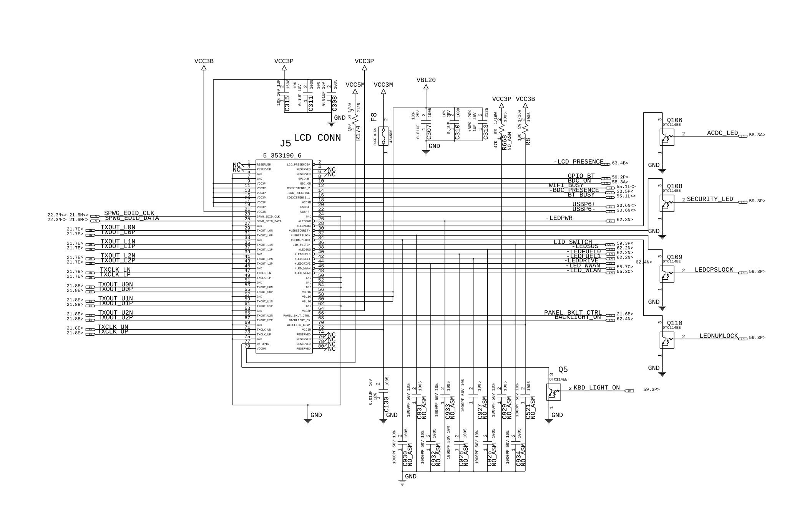

# Screen

← [Back to README](../README.md)

The screen situation is probably the most complicated part of the whole build. There are problems on multiple fronts: the backlight technology, the signal protocol, and the physical connector.

## The Panels

Three panels are in scope. Specs are in this folder.

**Samsung [LTN141P4-L03](specs_14inch_Samsung_LTN141P4-L03.pdf)** — 14 inch, 1400x1050, CCFL backlight, LVDS. This is the stock panel and a drop-in fit. No modern eDP replacement has been found for this size.

**Hydis [HV150UX2-100](specs_15inch_Hydis_HV150UX2-100.pdf)** — 15 inch, 1600x1200, LED backlight, LVDS. Has a known replacement kit available ([tpart.net](https://www.tpart.net/product/hv150ux2-100-led-inverter-screen-cable-set-for-t60-t70-t700-led-back-light)) but it's not a drop-in — different pinouts and no inverter needed.

**Innolux [G150XJE-E01](specs_15inch_Innolux_G150XJE-E01.pdf)** — 15 inch, 1024x768, LED backlight, eDP. Not a drop-in either, and the resolution is a significant downgrade.

## CCFL → LED Swap

For the 14 inch, one option is to keep the Samsung panel and swap the CCFL backlight for an LED strip using a conversion kit. It's a delicate operation — forums are pretty consistent that the first attempt almost always results in uneven backlight. Not impossible, just fiddly.

Best lead: https://www.youtube.com/watch?v=OePaH6EyblY

## The LVDS Problem

The bigger issue is that modern GPUs output eDP or HDMI, not LVDS. So a converter is needed regardless of which panel is used.

There are two types of converters on the market:

**Bridge IC** — preferred approach. It's a single chip that translates DisplayPort packets to LVDS. Fewer active components, and some datasheets claim it can read the panel's EDID and pass it upstream to the GPU, meaning you don't have to burn custom timings. The Samsung panel has a very detailed spec sheet with full EDID and timing info, which helps a lot here.

**Scalar board** — a full board that re-synthesizes the LVDS signal. Needs the exact panel timings burned into it. Can take HDMI in. More moving parts.

Off-the-shelf converters are mostly built for 16:9 common resolutions and won't work with the 4:3 panels out of the box. Reached out to a couple of vendors:

- **Geekworm** (HDMI-LVDS adapter) — asked about custom support, told to order in bulk or go away.
- **AliExpress vendor** selling DP bridge ICs — was actually helpful, looked at the datasheet, but said they can't add support for this resolution.

So the path forward is likely sourcing a bridge IC directly and either finding one with the right resolution support or going deeper into the datasheet to see if it can be configured.

## Connector

See [Connectors](../Connectors/connectors.md#screen-assembly) for the confirmed part.

