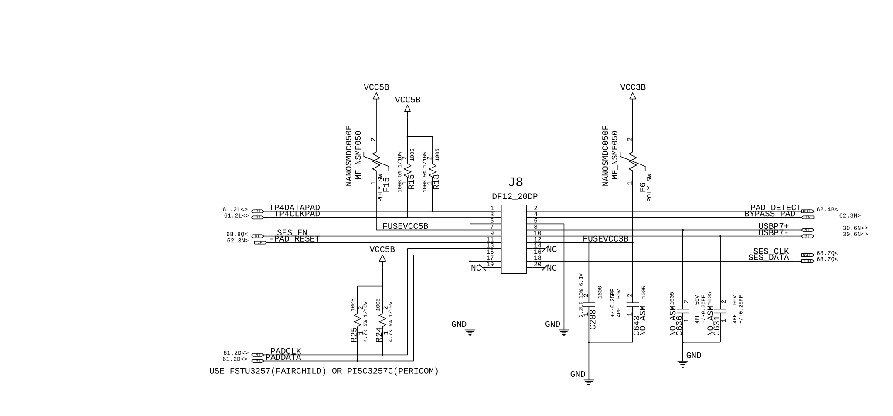

# Touchpad

← [Back to README](../README.md)

The T60 touchpad runs over PS2, so the bridging process should be fairly straightforward — similar approach to the keyboard. The connector is ~99% identified but hasn't been ordered and physically verified yet.

See [Connectors](../Connectors/connectors.md#touchpad) for the full spec and candidate parts.

## Status

Not started beyond connector research. Once the keyboard interface is working, this should follow a similar process and shouldn't be too difficult.
