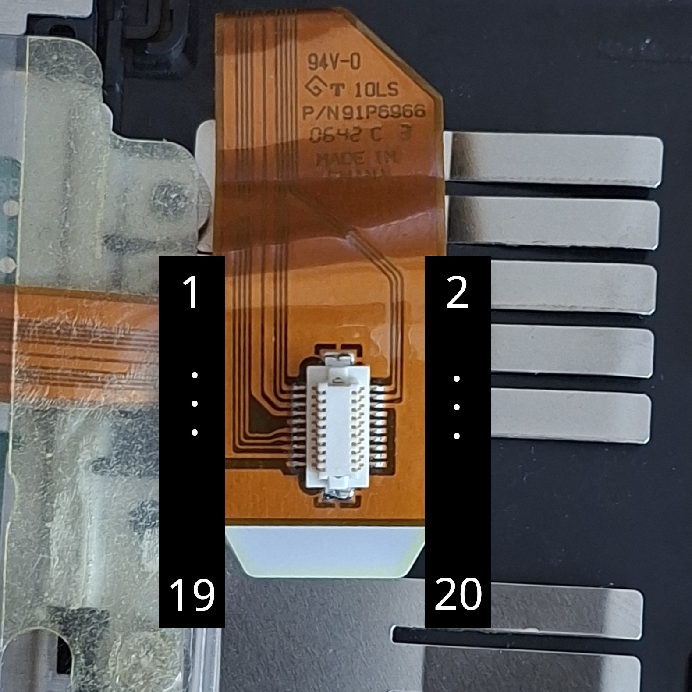

← [Back to README](../README.md)

# Touchpad

The T60 touchpad runs over PS/2. The connector is confirmed. See [Connectors](../Connectors/connectors.md#touchpad) for the full spec.

## Status

PS/2 interface confirmed working. Test sketch in `test_touchpad/`.

## Wiring (Arduino Mega)

| Hirose Pin | Signal    | Arduino Mega Pin |
|------------|-----------|------------------|
| 7          | VCC5B     | 5V               |
| 11         | PAD_RESET | 52               |
| 13         | PADCLK    | 2                |
| 15         | PADDATA   | 3                |
| 17         | GND       | GND              |

PADCLK and PADDATA require 10kΩ pull-up resistors to 5V.

Pins 2 and 3 are hardware interrupt pins (INT0/INT1) — the CLK line triggers an interrupt on each falling edge to capture bits.

## Reset polarity

PAD_RESET is active low — hold HIGH normally, pulse LOW to reset.

## Protocol

Standard PS/2 mouse, 3-byte packets in stream mode: status byte, X delta, Y delta.

Status byte layout:

| Bit | Meaning |
|-----|---------|
| 0   | Left button |
| 1   | Right button |
| 2   | Middle button |
| 3   | Always 1 (sync check) |
| 4   | X sign (negative if set) |
| 5   | Y sign (negative if set) |

Y is inverted relative to screen coordinates — negate it.

Tap-to-click is handled in the touchpad firmware and comes through as a left button press.

